# Bitcoin Power Law Analysis and Retirement Planning

## Bitcoin Price (Linear Scale)
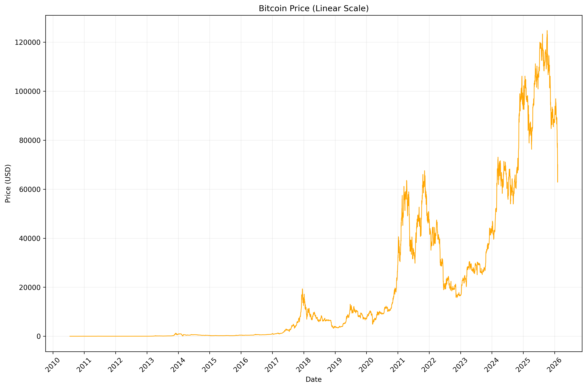

## Bitcoin Price (Log-Linear Scale)
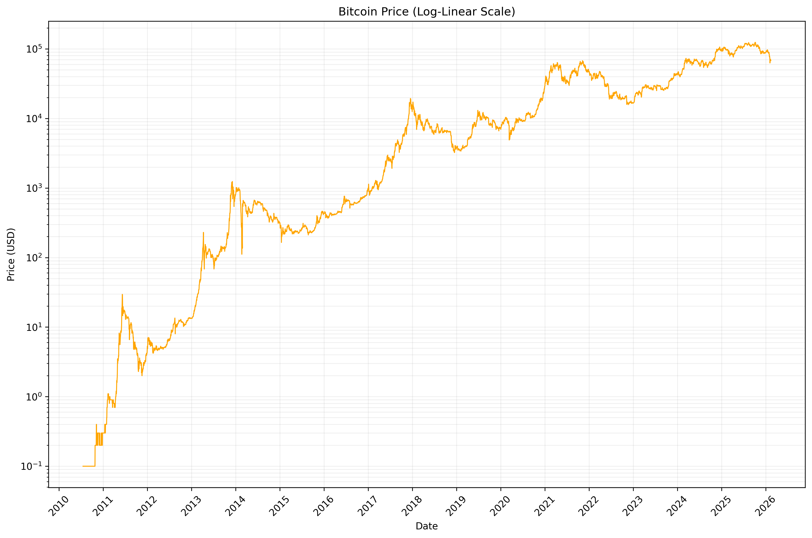

## Bitcoin Price (Log-Log Scale)
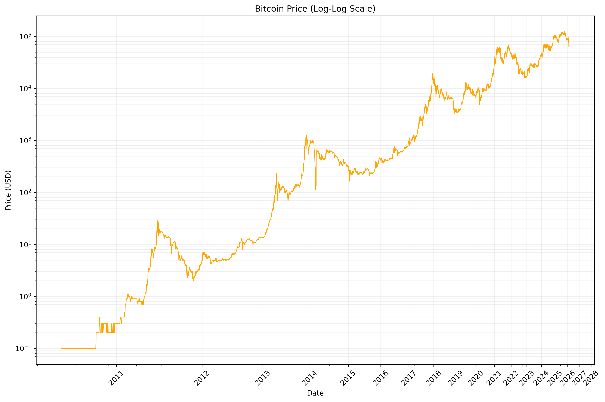

## Log-Log Power Law Model
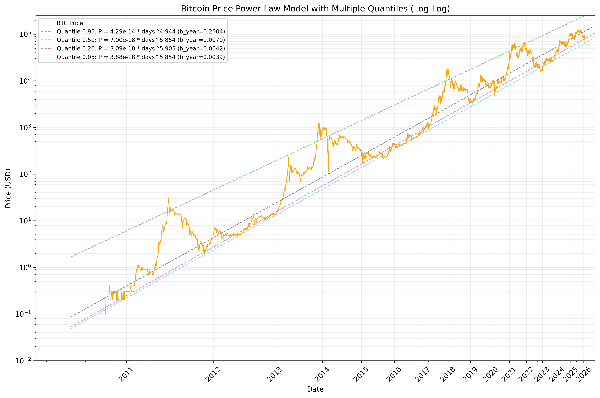

## Log-Log Power Law Model Future Extrapolation
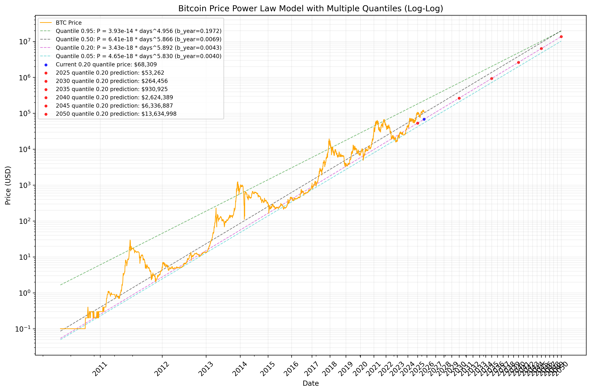

## Linear-Log Scale Model
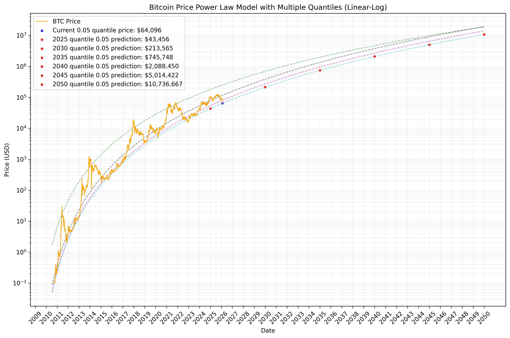

## Zooming in on Today
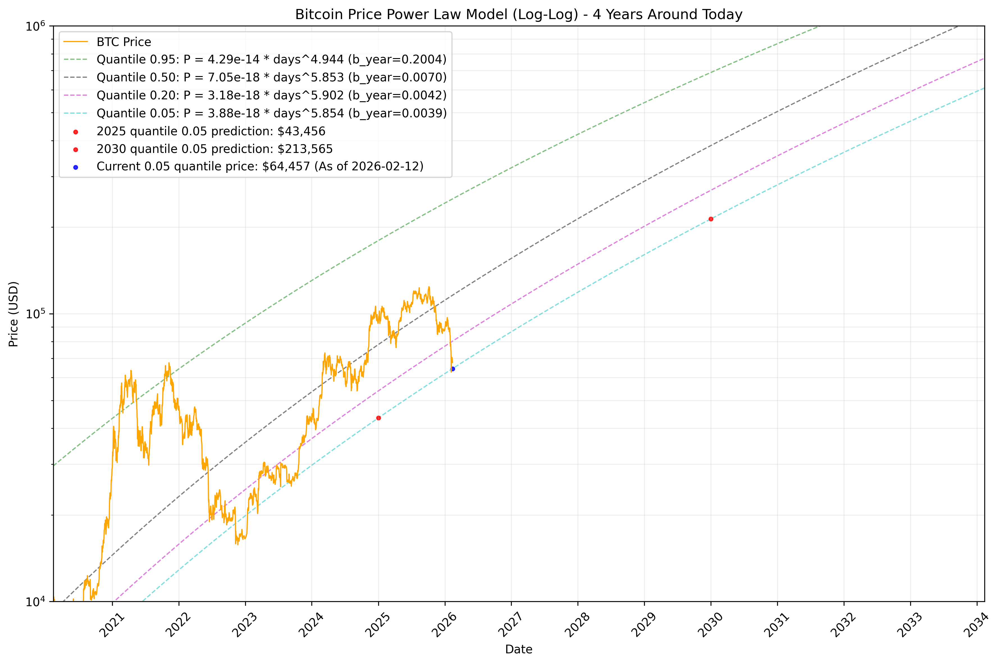

## Linear-Linear Scale Model
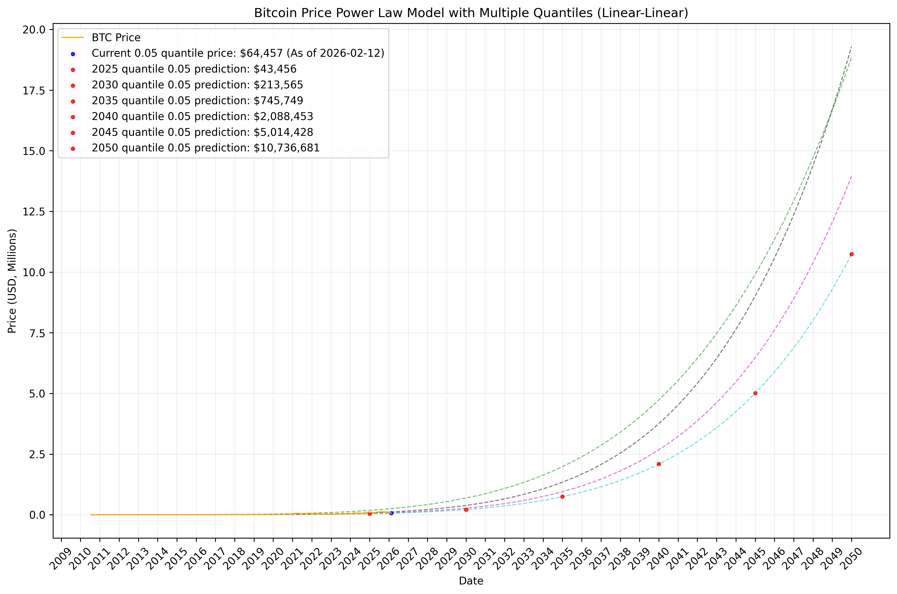

## Quantile Ratio Analysis

Is the price over time converging toward the power law line?

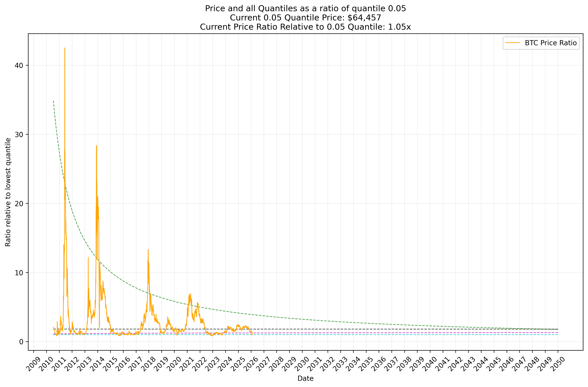

## Years Ahead of Conservative Estimate

For each price (colored lines) we can estimate how many years until that price will be the trend price.

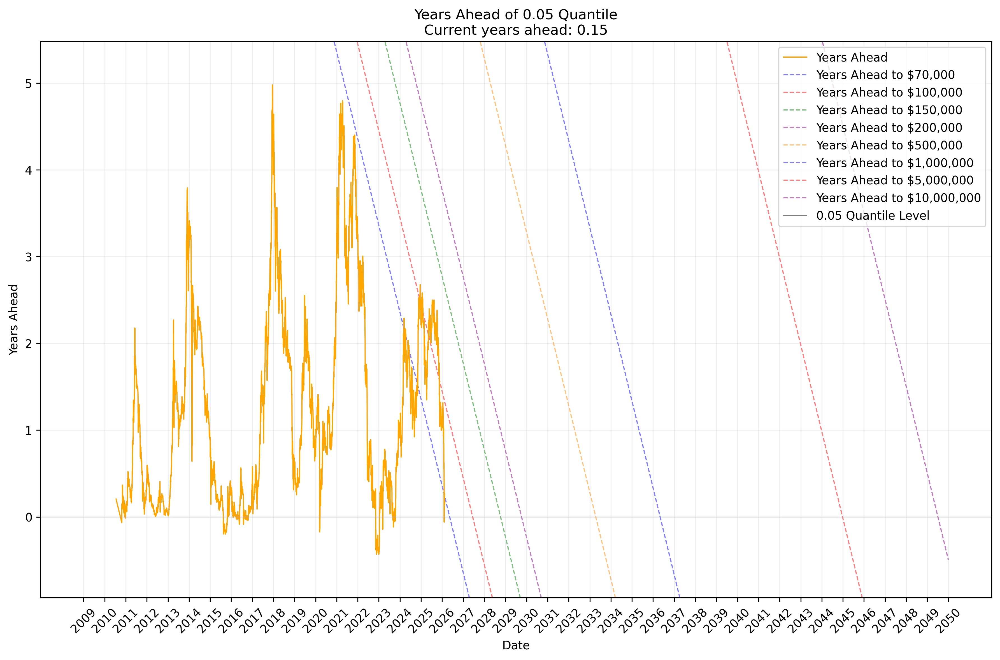

## Raw ROI Analysis

Is the backwards looking ROI converging towards the ROI predicted by the power law?

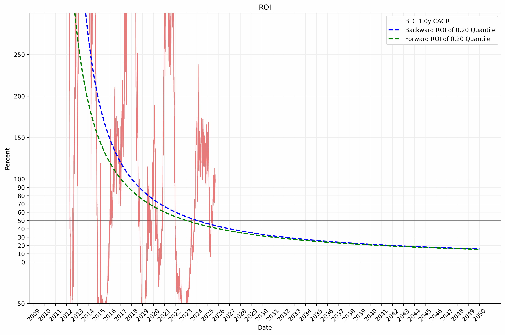

## Dollar Cost Averaging Strategy
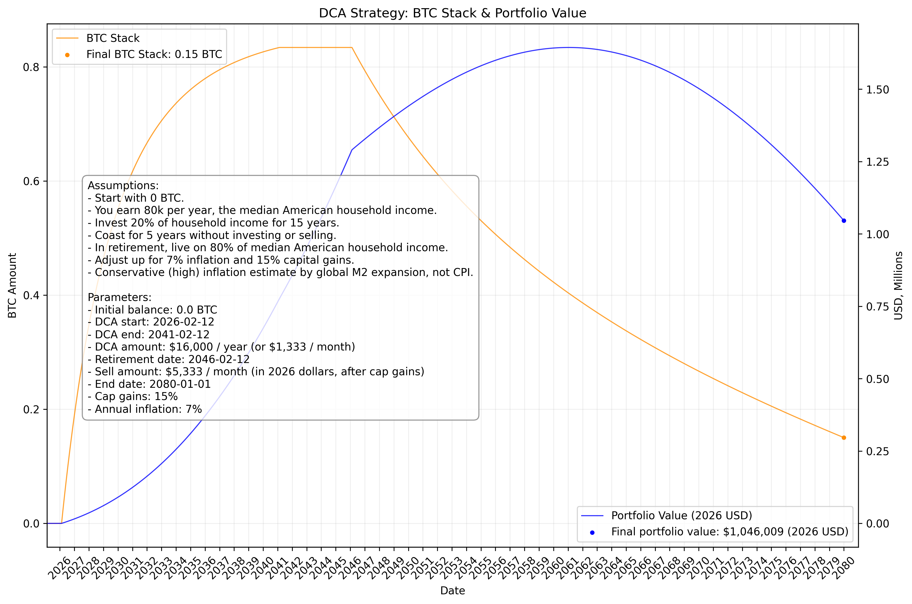

# Appendix: convergence of power law over time

The lower bound (blue line) of the lower law stabilized around 2016 or 2017:

# Appendix: Price vs contemporary power law

At each date, the power law is fitted on history up to that date. These charts shows how actual price and each quantile band have tracked those contemporary fits over time. This can help us understand how power law predictions have evolved with each cycle as new data comes in.

## Price vs contemporary power law (date, log price)

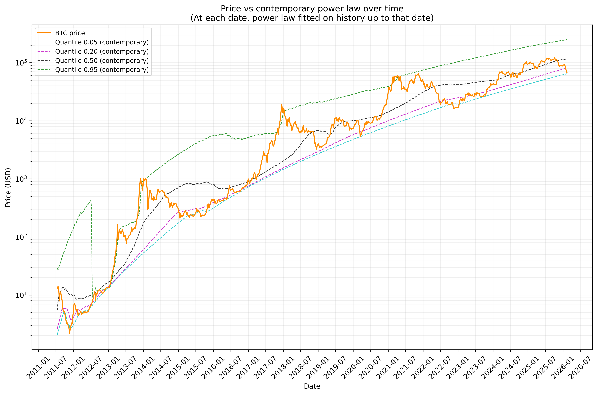

## Price vs contemporary power law (log-log)

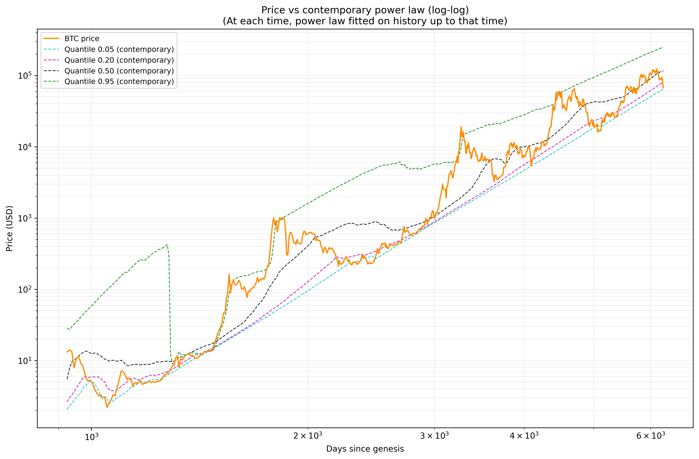
